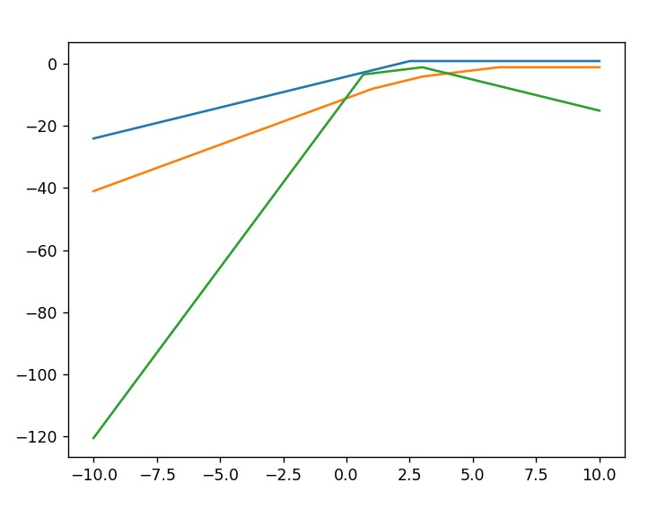

# Tropical-Geometry
Project involving implementing a basic interface for tropical geometry. Includes graphing utility. TODO: implement UI. Currently blocked by how to parse user input function.

## Background

Tropical Geometry and its deeper ideas are beyond the author (i.e. the context of tropical geometry in the context of algebraic geometry and algebraic varieties).

Tropical Geometry is defined by the tropical semi-ring. The tropical semi-ring is, in a sense, an algebraic re-imagination of the extended real numbers (extended real numbers to mean real numbers as well as positive and negative infinity). Here the notions of addition and multiplication are replaced with tropical variants

For tropical addition, we define:
```math
x,y \in \mathbb{R} \cup \{+\infty, -\infty\}, \qquad x \oplus y \equiv \min(x,y)
```

For tropical multiplcation, we define:
```math
x,y \in \mathbb{R} \cup \{+\infty, -\infty\}, \qquad x \otimes y \equiv x+y
```

that is to say that addition is the min operation (with $\infty$ as the unital element, i.e.: $x \oplus \infty = x$). 

The "semi" part of semi-ring comes because the "addtion" operation here does not necessarily admit an inverse element for an arbitrary element, i.e. (for mathematicians), sometimes $\nexists y \in \mathbb{R} \cup$ { $+\infty, -\infty$ }, s.t. $x \oplus y = -\infty$

## Inspiration

The graphs looked cool.

An example of a graph:



## How to use (as of now)

Simply clone the repository, install requirements.

Use "main.py" as entry point. Create a graph object e.g. `graph = Graph()`. To create a function, make sure the output is a tropical number given a tropical number, then use `graph.add_func(<<function_name>>)` to add the function with `<<function_name>>`. To display a plot, do: `graph.plot()`

Other things can be done, refer to `Graph`.


